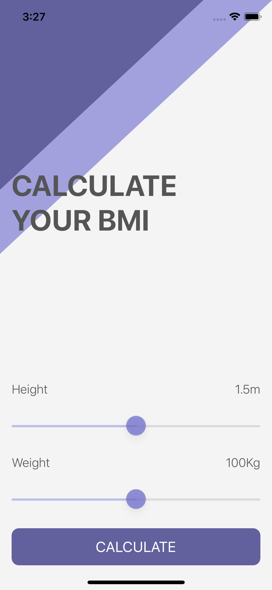

# iOS-BMI-Calculator
This is my "BMI Calculator" project from Section 11: Advanced Swift Programming - Classes, Inheritance & Advanced Optionals from the Udemy course "iOS 13 & Swift 5 - The Complete iOS App Development Bootcamp"

